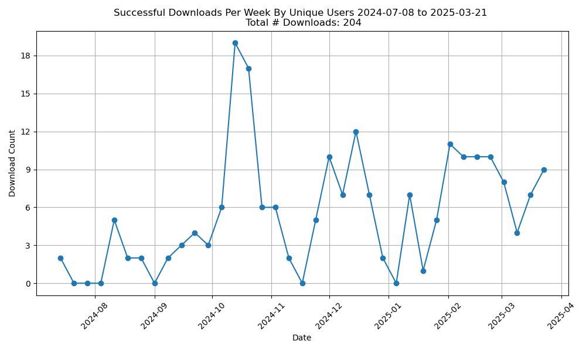

# Tracking Repo Usage: Server Access Logging
To track the number of repository downloads, views, and other information, you can parse [server access logs](https://docs.aws.amazon.com/AmazonS3/latest/userguide/ServerLogs.html), which provide detailed records for all requests made to a bucket. 

## Bucket Configuration
You will first need to ask the Informatics Hub to enable AWS S3 server access logging - see instructions and details under [Enabling Amazon S3 server access logging](https://docs.aws.amazon.com/AmazonS3/latest/userguide/enable-server-access-logging.html). Informatics will create a separate bucket to stash the logs. They will then need to update the permissions appropriately (see [Permissions for log delivery](https://docs.aws.amazon.com/AmazonS3/latest/userguide/enable-server-access-logging.html#grant-log-delivery-permissions-general)). 

At minimum, the permissions for your IAM user or role should include the following policy statement to allow listing objects in the specific S3 bucket and getting objects from the bucket:

```json
{
    "Effect": "Allow",
    "Action": "s3:ListBucket",
    "Resource": "arn:aws:s3:::bobsrepository-logs"
}
{
    "Effect": "Allow",
    "Action": "s3:GetObject",
    "Resource": "arn:aws:s3:::bobsrepository-logs/*"
}
```
  
Server access logging captures every request made to your bucket, including GET requests (downloads). Note that it takes up to 48 hours to populate with logging data. 

## Install AWS CLI
Install the AWS CLI to download logs from the command line (see full instructions [here](https://docs.aws.amazon.com/cli/latest/userguide/getting-started-install.html)) and confirm successful installation:

*For Mac users:*
```bash
curl "https://awscli.amazonaws.com/AWSCLIV2.pkg" -o "AWSCLIV2.pkg"
sudo installer -pkg AWSCLIV2.pkg -target /

# Verify the installation
which aws
aws --version
```

## Downloading Logs
Once logs are available, download them locally in order to parse them.

### Option 1 - Use Download Script [*Recommended*]
Use the script [download_logs.sh](https://github.com/DCAN-Labs/opendatainit-docs/blob/main/code/download_logs.py). This script will prompt you for your credentials and download logs from the specified bucket and save them to a local directory (`./downloaded_logs`). This script is useful as it will skip any folders that have already been downloaded, and will only download new logs:

```bash
python3 download_logs.py --bucket bobsrepository-logs
```

### Option 2 - Use CLI Via Command Line
Alternatively, you can simply run `aws configure` to configure with your IAM user credentials - you will be prompted for your Access Key ID, Secret Access Key), Region (e.g., us-east-2), and Output format (e.g., json) - followed by `aws s3 cp` to copy the logs to a local directory:
```bash
# Configure AWS CLI
aws configure

# Copy logs to local directory
aws s3 cp s3://bobsrepository-logs/ ./logs/ --recursive
```

## Parsing Logs
The logs will contain information in the [AWS format](https://docs.aws.amazon.com/AmazonS3/latest/userguide/LogFormat.html), corresponding to the following fields:

```css
bucket_owner bucket [datetime] remote_ip requester request_id operation key request_uri 
http_status error_code bytes_sent object_size total_time turn_around_time referrer 
user_agent version_id host_id signature_version cipher host tls_version access_point_arn 
acl_required
```

To get information about number of downloads (by unique users) over time, the log information we are interested in is:

- operation: REST.GET.OBJECT
- HTTP status: 200 (successful)
- key: the file being downloaded
- requester or remote_ip: who downloaded it
- Date (to track over time)

To parse the logs, use the script [parse_access_logs.py](https://github.com/DCAN-Labs/opendatainit-docs/blob/main/code/parse_access_logs.py). An example usage is:

```bash
python3 parse_access_logs.py --logdir /path/to/downloaded_aws_logs
```

This script will output csv files in a folder called `parsed_logs` with the full list of successful downloads over time (`parsed_output.csv`). The file `parsed_output_filt.csv` contains successful downloads over time with duplicate IP addresses removed to identify unique users, removal of logged downloads without values for `object_size` or `bytes`, and potential bot activity filtered (based on the strings `bot` and/or `crawl` in the `user_agent` field). The code will also generate the figure `downloads_over_time.png` from the latter csv file, which shows the number of downloads per week, with the total number number over time listed in the title:


