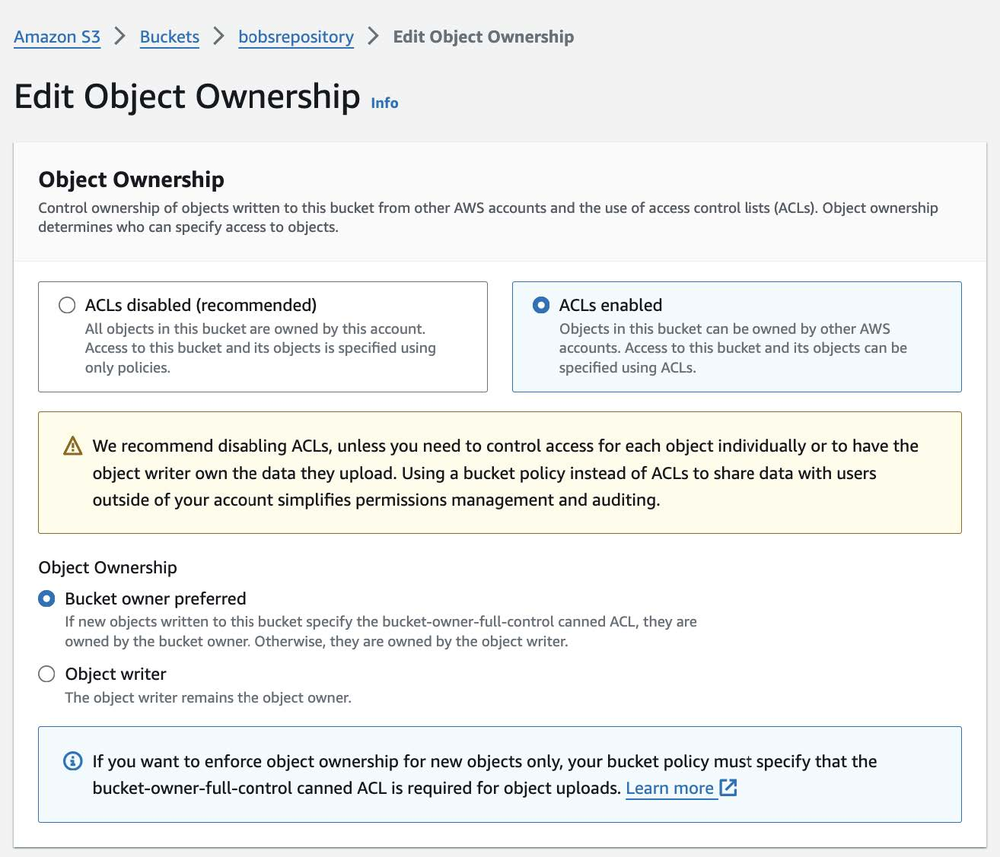

# Create Amazon AWS S3 Bucket

The process for making an S3 bucket is a bit different than one might expect as it first requires review and approval from Amazon. This is done by forking the AWS open-data-registry repository on Github, creating a new configuration file with information about your data, and submitting a pull request (PR) for review. The [AWS Onboarding Handbook for Data Providers](https://assets.opendata.aws/aws-onboarding-handbook-for-data-providers-en-US.pdf) provides a straightforward summary to make the process fairly simple and quick as long as you have information about the data readily available.

## Step 1: Communicate With Informatics Hub
Please refer to the internal documentation for this step [here](https://drive.google.com/file/d/1FnK1Mi5KImr2UkgCw5IpF_Dp_e-YvK6z/view?usp=sharing).

## Step 2: Fork AWS Github Repo & Create YAML
***Forking***  
Make sure that you have Owner permissions in the DCAN-Labs organization. Then, when forking the [AWS Open Data Registry Github](https://github.com/awslabs/open-data-registry?tab=readme-ov-file), select the DCAN-Labs organization under “Choose Owner.”

***Decide on Repository Short Name***  
For the Baby Open Brain (BOBs) Repository, we used “bobsrepository.” You’ll want to decide on a short name and use it consistently for the name of your YAML file, its contents, when setting up DataLad, etc.

***Create YAML File***  
After forking, you’ll need to add a new YAML file containing information about the dataset under the `/datasets` folder. Please see the full template README provided [here](https://github.com/awslabs/open-data-registry?tab=readme-ov-file#how-are-datasets-added-to-the-registry) as well as the [BOBs Repository YAML](https://github.com/LuciMoore/open-data-registry/blob/main/datasets/bobsrepository.yaml) for reference (you can start by making a copy of the latter, updating the information for your data repository, and crossreferencing with the template README to add any additional information you may want).

***Additional Tips:***

* When updating the YAML file, you can use Google Docs for collaborative editing of the YAML file, but keep in mind that this may change the formatting, so for final steps make sure to use a text editor  
* Follow YAML formatting (see quick overview [here](https://stackoverflow.com/a/22235064)), including using quotes for string values that include special characters  **`:`, `{`, `}`, `[`, `]`, `,`, `&`, `*`, `#`, `?`, `|`, `-`, `<`, `>`, `=`, `!`, `%`, `@`, `\`** . Using quotations when they are not necessary however will not cause any errors, so feel free to err on the side of caution if unsure. Additionally, formatting errors are caught during continuous integration after submitting your PR, so can easily be fixed at that point.     
* Leave the attribute values for `ManagedBy` unchanged  
* Under `Resources`:  
    * Leave `Region` and `Type` unchanged  
    * For `ARN` and `Explore`, replace the string `bobsrepository` with the short name you have chosen to use for your own repository (the bucket and links don’t actually exist yet of course, but that’s ok)  
* We recommend choosing a license for your repository. This is not required, however, in which case you can just follow the README template example for this field and enter: `There are no restrictions on the use of this data`

*Note that you are welcome to proceed to Step 3 to submit a pull request before you are finished finalizing the YAML file. Just make sure to keep the PR in draft mode until ready for review.*

## Step 3: Create Tutorial  
Within the YAML file (under `DataAtWork` > `Tutorials`), you are required to provide a link to a “tutorial,” which for a data repository can simply be instructions on how to access and download the data. The BOBS Repository YAML currently links to the [View or Download the BOBS Repository](https://bobsrepository.readthedocs.io/en/latest/data_access/) section of the [BOBS Repository Docs page](https://bobsrepository.readthedocs.io/en/latest/), but for the initial submission for review, we created a simple markdown file on a public GitHub repository that, following the layout of the [INDI tutorial](https://fcon_1000.projects.nitrc.org/indi/s3/index.html), provided a basic explanation of the data format/organization and how to access via Cyberduck. 

## Step 4: Submit Pull Request
Submit a PR to the central repository and inform the Informatics Hub. Informatics will contact Amazon to link the repository with the MIDB account (Step 4 in the [AWS Handbook](https://assets.opendata.aws/aws-onboarding-handbook-for-data-providers-en-US.pdf)), create the S3 bucket referenced in the YAML (assuming it is available), and inform Amazon that the necessary steps to merge the PR have been completed. Once merged (this may take a few days), you will be provided with AWS credentials for read/write access to the bucket and you can proceed to upload your data! 

## Step 5: Configure AWS Bucket
Informatics will handle the majority of the configurations required to make the bucket publicly available, but there may be additional features you wish to employ that require access to the AWS web console. You can either request Informatics (the "root" user) to make these updates for you or ask that they add you as an [IAM user](https://docs.aws.amazon.com/IAM/latest/UserGuide/id_users.html) to access the web console directly to make changes. The following are recommended configurations to ensure public accessibility and allow tracking for repository usage:

### Enable ACLs Under Object Ownership
Though Amazon generally recommends using a bucket policy instead, our current process requires that **ACLs enabled** be checked under **Object Ownership**:

### Update ACL Permissions
While AWS buckets are publicly accessible and can be downloaded using Cyberduck or a web browser (if the `index.html` file is properly configured), individual file permissions may still prevent users from accessing the repository.

To update Access Control Lists (ACLs) and allow external users to download data:

1. Go to **Permissions** tab  
2. Scroll down to **Access control list (ACL)**
3. Click **Edit** and check the **List** and **Read** boxes for: 
    - **Authenticated users groups** (anyone with an AWS account)
    - (Optional) **Everyone (public access)** if broader access is desired.  
4. Check **I understand the effects of these changes on my objects and buckets**
5. Click **Save changes**.

### Tracking Repository Usage
In order to view statistics collected for your repository, Informatics will need to give your IAM account “Storage Lens” permissions. If you are interested in obtaining more detailed information, including the number of people who have viewed and/or downloaded the repository - including anonymous downloads via Cyberduck or web browser - Informatics will create a separate bucket to stash server access logs that contain more detailed information (see [Enabling Amazon S3 server access logging](https://docs.aws.amazon.com/AmazonS3/latest/userguide/enable-server-access-logging.html)). Note that it takes up to 48 hours to populate with logging data. 

## Additional Resources
[AWS Samples](https://github.com/aws-samples/)  
[Youtube tutorial: adding your data to Registry of Open Data on AWS](https://www.youtube.com/watch?v=5nocWdjN1DA)

