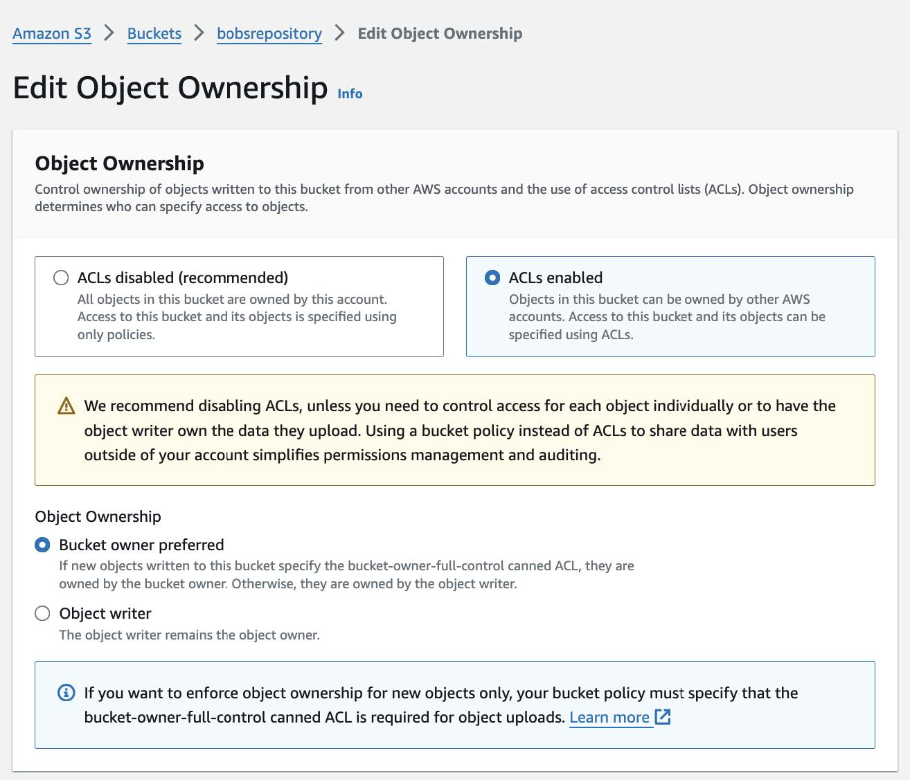

# Step 2: Create Amazon AWS S3 Bucket

Below are steps to setting up a new Amazon AWS S3 bucket. In summary, you create a fork of the AWS [open-data-registry](https://github.com/awslabs/open-data-registry) repository on Github, add a configuration file for your repository to [`datasets/`](https://github.com/awslabs/open-data-registry/tree/main/datasets), and submit a pull request (PR) for Amazon to review. 

**Additional Resources**

- [open-data-registry](https://github.com/DCAN-Labs/open-data-registry?tab=readme-ov-file#registry-of-open-data-on-aws)
- [Onboarding Handbook for Data Providers](https://assets.opendata.aws/aws-onboarding-handbook-for-data-providers-en-US.pdf) (starting at Step 5: Preparing & uploading data)

## Link to MIDB Account

All data MIDB ODI repositories live under the MIDB departmental AWS account managed by the Informatics Hub. Please contact Lucille Moore, who can facilitate connecting you with the Informatics Hub to initiate the process of requesting a new data repository setup, i.e. a new S3 bucket on Amazon AWS.

## Update DCAN-Labs Repository Fork 

The registry of open data is located in the [open-data-registry](https://github.com/awslabs/open-data-registry) repository. A forked version under DCAN-Labs is [here](https://github.com/DCAN-Labs/open-data-registry); select **Sync fork** to update.

You will need to add a new YAML file to this repository under `/datasets` using the standard name you decided on for the project. Instructions for how to generate this file are provided in the repository README, but you can also just make a copy of the [BOBs Repository YAML](https://github.com/LuciMoore/open-data-registry/blob/main/datasets/bobsrepository.yaml) and update the fields as needed.

Some additional field recommendations include:  

* Leave the attribute values for `ManagedBy` unchanged  
* Under `Resources`:  
    * Leave `Region` and `Type` unchanged  
    * For `ARN` and `Explore`, replace the string `bobsrepository` with the short name you have chosen to use for your own repository (the bucket and links don’t actually exist yet of course, but that’s ok)  
* We recommend choosing a license for your repository. This is not required, however, in which case you can just follow the README template example for this field and enter: `There are no restrictions on the use of this data`

Finally, rememeber to follow YAML formatting (see quick overview [here](https://stackoverflow.com/a/22235064)), including using quotes for string values that include special characters  **`:`, `{`, `}`, `[`, `]`, `,`, `&`, `*`, `#`, `?`, `|`, `-`, `<`, `>`, `=`, `!`, `%`, `@`, `\`** . Using quotations when they are not necessary will not cause any errors, so feel free to err on the side of caution if unsure. Additionally, formatting errors are caught during continuous integration after submitting your PR, so can easily be fixed at that point.     

<!-- *Note that you are welcome to proceed to Step 3 to submit a pull request before you are finished finalizing the YAML file. Just make sure to keep the PR in draft mode until ready for review.* -->

## Create Tutorial  
Within the YAML file (under `DataAtWork` > `Tutorials`), you are required to provide a link to a “tutorial,” which for a data repository can simply be instructions on how to access and download the data. The BOBS Repository YAML currently links to the [View or Download the BOBS Repository](https://bobsrepository.readthedocs.io/en/latest/data_access/) section of the [BOBS Repository Docs page](https://bobsrepository.readthedocs.io/en/latest/), but for the initial submission for review, we created a simple markdown file on a public GitHub repository that, following the layout of the [INDI tutorial](https://fcon_1000.projects.nitrc.org/indi/s3/index.html), provided a basic explanation of the data format/organization and how to access via Cyberduck. 

### Submit Pull Request
Submit a PR to the central repository and inform the Informatics Hub. Informatics will contact Amazon to link the repository with the MIDB account (Step 4 in the [AWS Handbook](https://assets.opendata.aws/aws-onboarding-handbook-for-data-providers-en-US.pdf)), create the S3 bucket referenced in the YAML (assuming it is available), and inform Amazon that the necessary steps to merge the PR have been completed. Once merged (this may take a few days), you will be provided with AWS credentials for read/write access to the bucket and you can proceed to upload your data! 

## AWS Bucket Configuration
The Informatics Hub can will handle the majority of the configurations required to make the bucket publicly available, but there may be additional features you wish to employ that require access to the AWS web console. You can either request Informatics (the "root" user) to make these updates for you or ask that they add you as an [IAM user](https://docs.aws.amazon.com/IAM/latest/UserGuide/id_users.html) to access the web console directly to make changes. The following are recommended configurations to ensure public accessibility and allow tracking for repository usage:

### Enable ACLs Under Object Ownership
Though Amazon generally recommends using a bucket policy instead, our current process requires that **ACLs enabled** be checked under **Object Ownership**:

### Update ACL Permissions
While AWS buckets are publicly accessible and can be downloaded using Cyberduck or a web browser (if the `index.html` file is properly configured), individual file permissions may still prevent users from accessing the repository.

To update Access Control Lists (ACLs) and allow external users to download data:

1. Go to **Permissions** tab  
2. Scroll down to **Access control list (ACL)**
3. Click **Edit** and check the **List** and **Read** boxes for: 
    - **Authenticated users groups** (anyone with an AWS account)
    - (Optional) **Everyone (public access)** if broader access is desired.  
4. Check **I understand the effects of these changes on my objects and buckets**
5. Click **Save changes**.

### Tracking Repository Usage
See [Server Access Logging](access-logging.md) for details on tracking the number of repository downloads.

## Additional Resources
[AWS Onboarding Handbook for Data Providers](https://assets.opendata.aws/aws-onboarding-handbook-for-data-providers-en-US.pdf)      
[AWS Samples](https://github.com/aws-samples/)  
[Youtube tutorial: adding your data to Registry of Open Data on AWS](https://www.youtube.com/watch?v=5nocWdjN1DA)

